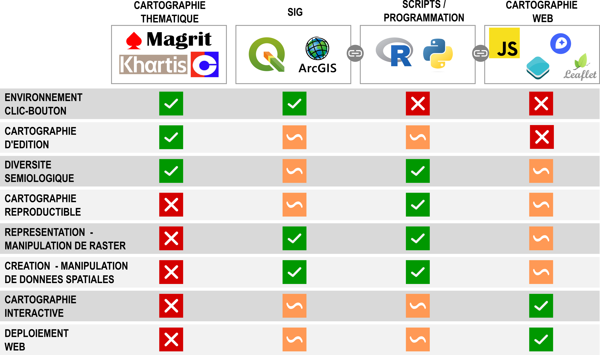

## Cartographie thématique avec Magrit

Support de formation d'une journée combinant une présentation des aspects théoriques relatifs à la cartographie thématique (matin) une mise en pratique avec Magrit (après-midi). 

   

### Public 

Débutant (pas de connaissance particulière en cartographie thématique).

### Programme

**Matin**

- Présentation du RIATE
- Histoire de la cartographie thématique
- Sources de l'information géographique
- Sémiologie graphique et variables visuelles
- Discrétisation
- Mise en page / habillage d'une carte
- Mise en carte d'un esprit critique. 1
- Map failed
- Quels outils pour quels usage ? 

**Après-midi**

- Présentation du logiciel Magrit
- Exo 1 : UEFA Champion's League / Collecter et importer des données dans Magrit, réaliser une carte en figurés proportionnels et mettre en page une carte.
- Exo 2 : Evolution de la population dans les départements français / Importer des données INSEE / réaliser une carte choroplèthe, choisir une méthode de discrétisation et une palette de couleurs adaptée. 
- Exo 3 : Combiner sur la même carte plusieurs modes de représentation (cf ex [Hauts-de-France](https://github.com/riatelab/MAGRIT-formations/blob/master/Formation_1_jour/exercices/Situation%203/Hauts_de_France_CSP.json)) / ou représentations carto avancées (cartogrammes, grilles régulières, discontinuités)...

## Réutiliser ces supports
CC-BY-SA

## Quel outil pour quel usage ? 

Magrit est une des nombreuses solutions logicielles qui permet de réaliser des cartographies thématiques. C'est une solution idéale pour le néophyte pour rentrer dans cet univers méthodologique : en quelques clics, il est possible de réaliser une représentation cartographique correctement mise en page.   

Ce n'est en revanche pas un outil destiné à de la manipulation de données spatiales (sélections par attribut, manipulation de rasters, géotraitements, etc.). Pour cet usage et dans un univers clic-bouton, on privilégiera l'usage des Systèmes d'information géographique, comme [QGIS](https://www.qgis.org/fr/site/). 

Pour les utilisateur·rices qui souhaitent intégrer leur représentation cartographique au sein d'une chaine de traitement, de l'import à la cartographie et qui sont sensibles à la reproductibilité de leur analyse, on privilégiera les solutions de programmation, comme celles proposées par le logiciel R ou Python et où les écosystèmes qui permettent de gérer de l'information spatiale sont particulièrement développés. La librairie [`mapsf`](https://riatelab.github.io/mapsf/) rend possible des types de représentations similaires à celles proposées par Magrit dans un univers R.  

Pour celles et ceux sensibles à la cartographie interactive et au portage sur le Web de leurs représentations, nous les invitons à se rapprocher des technologies JavaScript. De nombreuses librairies basées sur ce langage de programmation sont accessibles et permettent la réalisation de cartographies interactives, comme [OpenLayers](https://openlayers.org/), [mapbox](https://www.mapbox.com/) ou encore [Leaflet](https://leafletjs.com/). [bertin.js](https://github.com/neocarto/bertin) est d'ailleurs une librairie qui permet la réalisation de cartes thématiques pour le Web. 

Il est aussi important de rappeler que ces solutions techniques ne sont pas indépendantes les unes des autres : elles s'alimentent mutuellement : implémentation de chaines de traitement Python dans QGIS, adaptation des technologies leaflet dans les logiciels de programmation, etc. 

