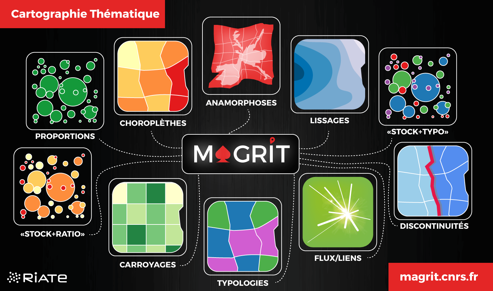

## Supports pour les formations en cartographie avec Magrit

Deux supports (cours + exercices) sont disponibles, calibrés pour 1 ou 2 jours de formation.
Ils sont destinés à un public n'ayant pas d'expérience particulière en cartographie thématique. 

   
